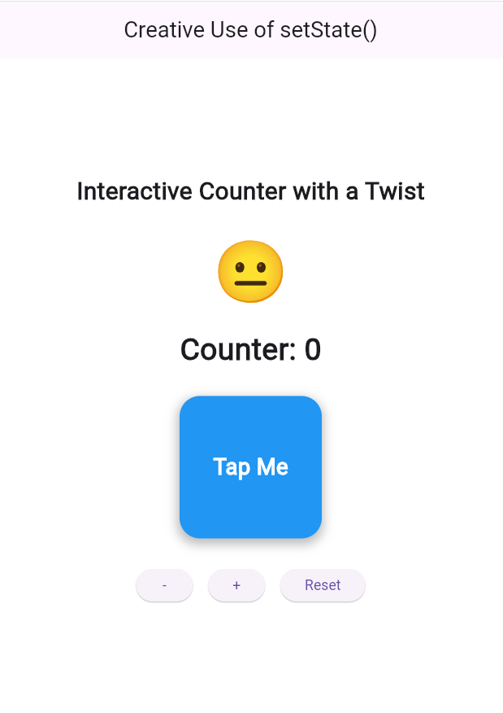
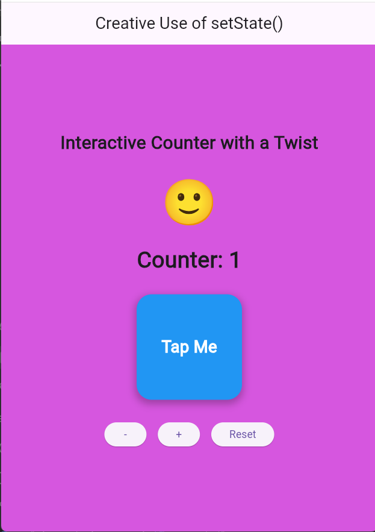
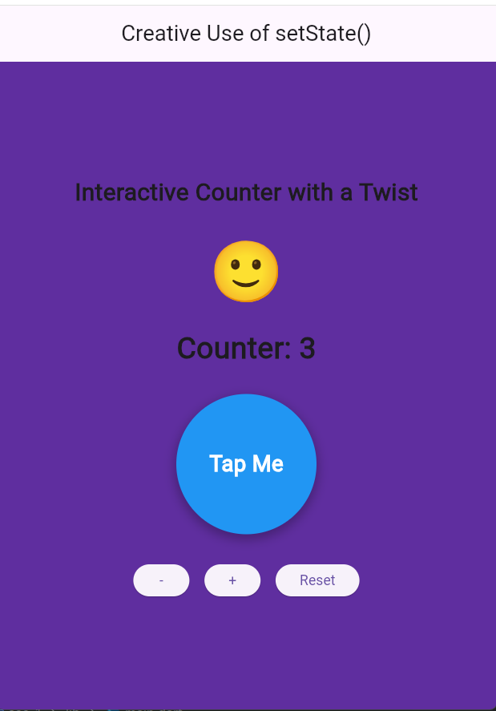

# Assignment 3 - Creative Use of setState()

This Flutter project demonstrates a creative use of the `setState()` method.

## Features
- Counter increases and decreases
- Background color changes dynamically
- Emoji changes based on counter value
- Container shape changes dynamically
- Reset button restores default state

## How setState() is used
The UI is rebuilt every time the user presses a button. Using `setState()`, the app updates:
- counter value
- emoji mood
- background color
- container shape

## Screenshots

